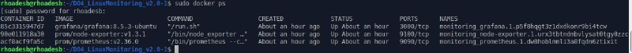

# Simple Docker

## Установить и настроить Prometheus и Grafana на виртуальную машину

Устанавливаем `Prometheus` 
```
sudo apt install prometheus 
```

запускаем его 

```
sudo systemctl start prometheus
```

Устанавливаем `Grafana`

``` 
sudo apt-get install -y adduser libfontconfig1 musl
wget https://dl.grafana.com/oss/release/grafana_9.2.4_amd64.deb && sudo dpkg -i grafana_9.2.4_amd64.deb
```

и запускаем ее
```
sudo systemctl enable grafana-server && sudo systemctl start grafana-server
```

## Получить доступ к веб интерфейсам **Prometheus** и **Grafana** с локальной машины

* Для доступа к панели Grafana откроем веб-браузер и перейдем по адресу нашего сервера, на котором установлена Grafana, используя порт (обычно 3000):
`http://localhost:3000` (здесь я написал localhost, потому что во время выполнения задания я периодически перезагружал систему, а соответственно IP адрес на enp0s3 менялся. Необходимо периодически прописывать актуальный адрес, который можно узнать по команде `ip a`)

* При первом входе введем логин: `admin` и пароль: `admin`. После этого система предложит изменить пароль.

* После успешного входа перейдем в раздел `Configuration` -> `Data Source` и кликнем на кнопку `Add Data Source`.

* В открывшемся окне выберем тип `Data Source` - `Prometheus`.

* В поле URL укажем адрес сервера, на котором работает Prometheus, и его порт. Поскольку Grafana установлена на том же сервере, что и Prometheus (стандартный порт 9090), используем `http://localhost:9090`.( `localhost` тоже самое, что и в первом пункте)

* Сохраняем внесенные изменения, нажав кнопку `Save and Test`.


## Добавить на дашборд **Grafana** отображение ЦПУ, доступной оперативной памяти, свободное место и кол-во операций ввода/вывода на жестком диске. Запустить ваш bash-скрипт из [Части 2]. Посмотреть на нагрузку жесткого диска (место на диске и операции чтения/записи)

Перед добавлением дашбордом, убедимся, что все сервисы запущены командой `docker ps`



Для создание dashboard нажимаем `Add panel->Add new panel`

Создаем по очереди панели для отображения:
1. `CPU`
2. `доступной оперативной памяти`
3. `всей памяти`, `занятой памяти` и `свободной памяти`
4. `количества операций ввода/вывода на жестком диске`

Отображение системы без нагрузки:


Запустим bash-скрипт из `Part 2` и смотрим на нагрузку жесткого диска


## Установить утилиту **stress** и запустить команду `stress -c 2 -i 1 -m 1 --vm-bytes 32M -t 10s` Посмотреть на нагрузку жесткого диска, оперативной памяти и ЦПУ
Установим утилиту `stress`
    ```
     sudo apt install stress
    ```
* Запустим команду
    ```
     stress -c 2 -i 1 -m 1 --vm-bytes 32M -t 60s
    ```
* Проверим результаты работы

    
